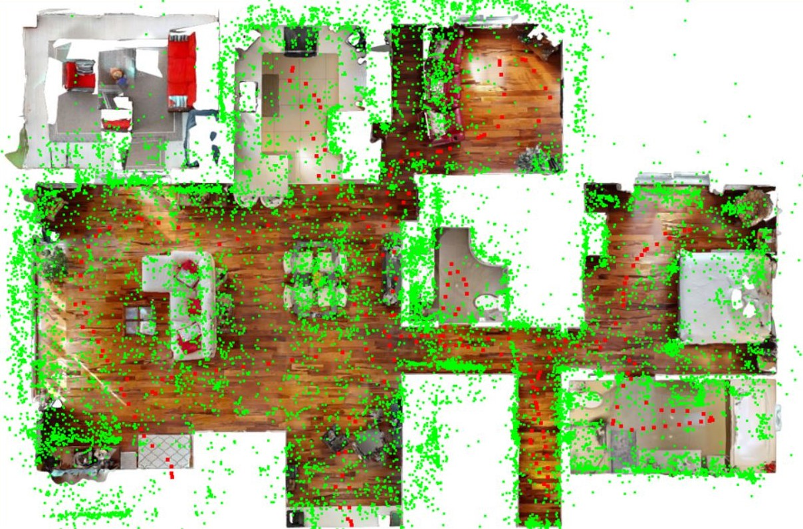

# 3D-2D-Point-Cloud-Registration

### The code will be open-sourced once after the publication.

## Results

### 1. Registration results

The below results display the registration of a 3d sparse map to a 2d floor plan improving the mapping pipeline.

  

### 2. Navigation results

The below results display the vision-based autonomous navigation in an indoor environment. 

  

